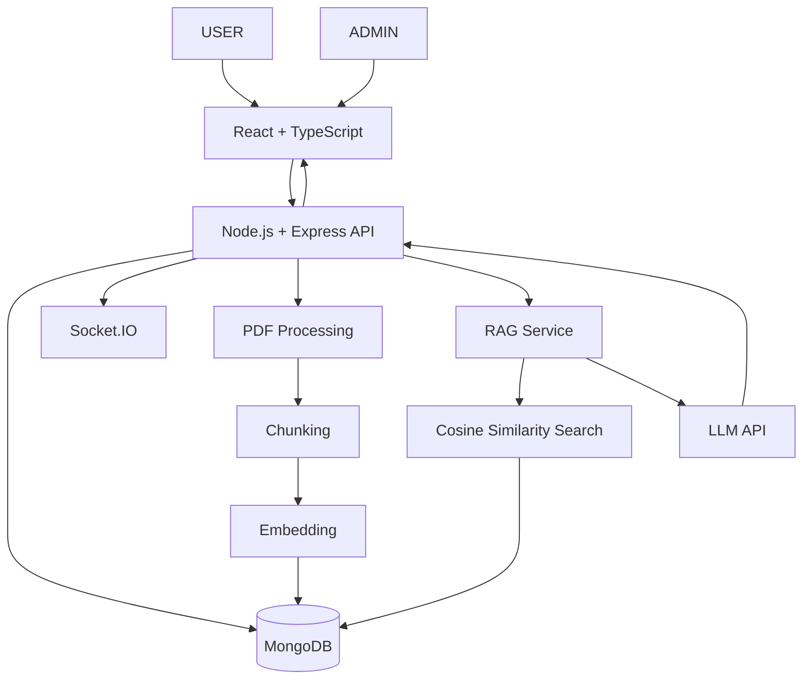
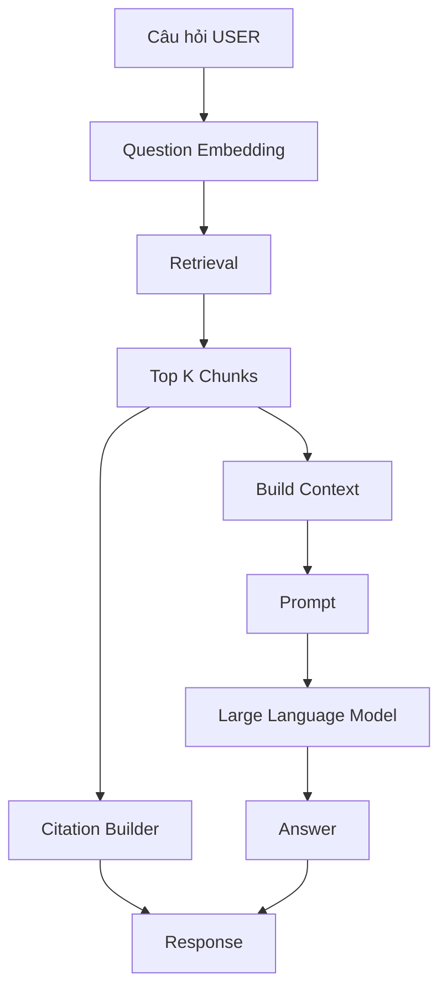
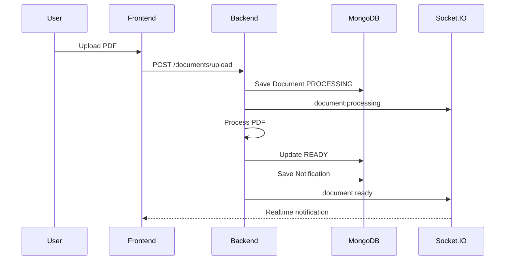
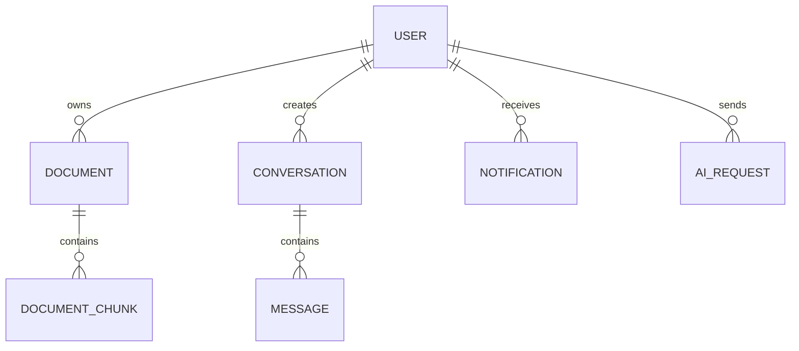
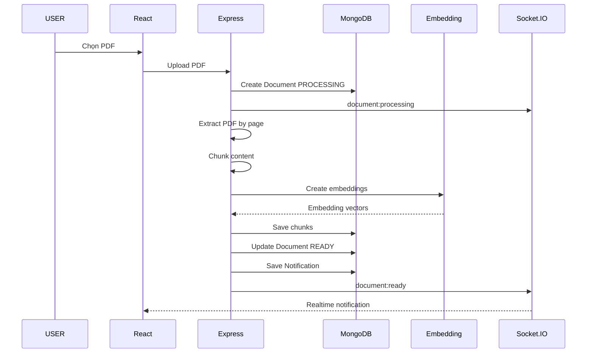
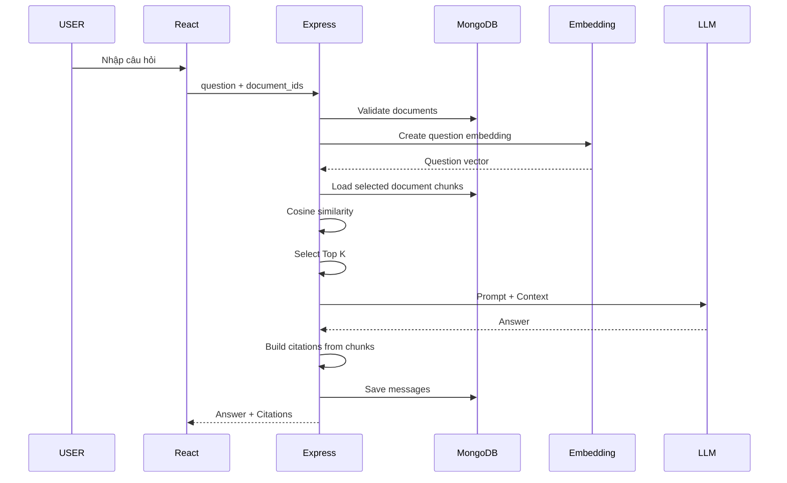

# DOCMIND AI – BUSINESS RULE

> **Tài liệu nghiệp vụ lõi (Business Rule)**
>
> Đề tài: **Nghiên cứu và xây dựng hệ thống trợ lý AI ứng dụng RAG và mô hình ngôn ngữ lớn trong hỏi đáp tài liệu chuyên ngành**
>
> Tên hệ thống: **DOCMIND AI**
>
> Mục tiêu của tài liệu này là thống nhất cách hiểu giữa các thành viên trong nhóm về **nghiệp vụ, phạm vi, công nghệ, dữ liệu, luồng xử lý và business rule** trước khi triển khai code.

---

# 1. Tổng quan hệ thống

## 1.1. Giới thiệu

DOCMIND AI là hệ thống trợ lý AI cho phép người dùng tải lên các tài liệu PDF và đặt câu hỏi trực tiếp trên nội dung tài liệu.

Hệ thống sử dụng mô hình **Retrieval-Augmented Generation (RAG)** kết hợp với **Large Language Model (LLM)** để:

- Đọc và xử lý tài liệu PDF.
- Chia nhỏ nội dung tài liệu thành các đoạn dữ liệu nhỏ (chunk).
- Chuyển nội dung thành vector embedding.
- Tìm kiếm những đoạn tài liệu liên quan nhất với câu hỏi.
- Đưa các đoạn tài liệu liên quan vào LLM làm ngữ cảnh.
- Sinh câu trả lời dựa trên tài liệu.
- Trích dẫn tài liệu và số trang tương ứng.
- Lưu lịch sử hội thoại.
- Tóm tắt tài liệu.
- So sánh nội dung giữa nhiều tài liệu.
- Gửi thông báo realtime khi tài liệu xử lý hoàn tất hoặc thất bại.

DOCMIND AI không chỉ giới hạn trong tài liệu giáo dục mà có thể áp dụng cho:

- Giáo trình UIT.
- Quy chế đào tạo.
- Tài liệu luật.
- Tài liệu lập trình.
- Tài liệu doanh nghiệp.
- Tài liệu nghiên cứu.
- Tài liệu nghiệp vụ nội bộ.

---

# 2. Mục tiêu của hệ thống

## 2.1. Mục tiêu chính

Xây dựng một hệ thống hỏi đáp tài liệu có khả năng:

1. Tiếp nhận tài liệu PDF từ người dùng.
2. Tự động trích xuất và xử lý nội dung.
3. Lập chỉ mục nội dung phục vụ tìm kiếm ngữ nghĩa.
4. Cho phép người dùng đặt câu hỏi bằng ngôn ngữ tự nhiên.
5. Trả lời dựa trên nội dung các tài liệu được lựa chọn.
6. Trích dẫn đúng tài liệu và đúng trang.
7. Hạn chế việc LLM tạo thông tin không tồn tại trong tài liệu.
8. Lưu lịch sử các phiên hội thoại.
9. Hỗ trợ tóm tắt và so sánh tài liệu.
10. Quản lý người dùng và tài liệu bằng tài khoản Admin.

## 2.2. Mục tiêu MVP trong giai đoạn chuyên đề

Do thời gian triển khai ngắn, phiên bản MVP tập trung vào các chức năng cốt lõi:

- Authentication.
- Phân quyền USER / ADMIN.
- Upload nhiều PDF.
- Quản lý tài liệu.
- PDF Processing.
- Chunking.
- Embedding.
- Retrieval bằng Cosine Similarity.
- RAG Chat.
- Citation theo số trang.
- Chat History.
- Summary.
- Compare Document.
- Notification bằng Socket.IO.
- Admin Dashboard cơ bản.
- Admin quản lý User.
- Admin quản lý Document.

Các chức năng nâng cao sẽ được đưa vào phần **Hướng phát triển**.

---

# 3. Vai trò hệ thống

Hệ thống có 2 vai trò chính.

## 3.1. USER

USER là người sử dụng các tính năng AI của DOCMIND AI.

USER có thể:

- Đăng ký tài khoản.
- Đăng nhập.
- Đăng xuất.
- Xem thông tin cá nhân.
- Upload nhiều tài liệu PDF.
- Xem danh sách tài liệu của mình.
- Xóa tài liệu của mình.
- Theo dõi trạng thái xử lý tài liệu.
- Nhận thông báo realtime khi xử lý hoàn tất.
- Tạo cuộc trò chuyện mới.
- Chọn một hoặc nhiều tài liệu để hỏi AI.
- Đặt câu hỏi.
- Xem câu trả lời AI.
- Xem citation.
- Xem lại lịch sử hội thoại.
- Tóm tắt tài liệu.
- So sánh 2 tài liệu.

USER không được:

- Xem tài liệu của USER khác.
- Xem conversation của USER khác.
- Truy cập route Admin.
- Quản lý tài khoản của người khác.
- Thay đổi cấu hình hệ thống.

## 3.2. ADMIN

ADMIN quản trị hệ thống.

ADMIN có thể:

- Đăng nhập vào khu vực quản trị.
- Xem Dashboard.
- Xem tổng số USER.
- Xem tổng số tài liệu.
- Xem tổng số conversation.
- Xem tổng số câu hỏi AI.
- Xem danh sách người dùng.
- Khóa / mở khóa người dùng.
- Xem danh sách tài liệu toàn hệ thống.
- Xóa tài liệu khi cần.
- Theo dõi trạng thái tài liệu.
- Xem một số thông tin hoạt động của hệ thống.

Phiên bản MVP chưa bắt buộc triển khai:

- Phân quyền nhiều cấp.
- Super Admin.
- Staff.
- Quản lý API Key động.
- Analytics chuyên sâu.
- Billing.
- Subscription.

---

# 4. Công nghệ sử dụng

## 4.1. Frontend

- **ReactJS**
- **TypeScript**
- **Vite**
- **Ant Design**
- **Axios**
- **TanStack Query**
- **React Router DOM**
- **Socket.IO Client**

### Deployment

- **Vercel**

## 4.2. Backend

- **Node.js**
- **Express.js**
- **TypeScript**
- **Mongoose**
- **JWT**
- **bcrypt**
- **Multer**
- **Socket.IO**

## 4.3. Database

- **MongoDB**
- **MongoDB Atlas** nếu deploy online.

## 4.4. AI / RAG

Phiên bản MVP ưu tiên viết pipeline RAG trực tiếp bằng Node.js để dễ kiểm soát và debug.

Các thành phần:

- PDF Parser.
- Text Chunking.
- Embedding API.
- Cosine Similarity Search.
- LLM API.
- Prompt Engineering.
- Citation Builder.

Có thể sử dụng một trong các LLM Provider:

- OpenAI.
- Google Gemini.
- Groq.
- Ollama.

Embedding có thể dùng:

- OpenAI Embedding.
- Gemini Embedding.
- Hugging Face Embedding.

## 4.5. Lưu file

Có thể lựa chọn:

### Giai đoạn development

Lưu file local:

```text
/uploads
```

### Giai đoạn deploy

Có thể sử dụng:

- Cloudinary.
- S3-compatible storage.
- Supabase Storage.
- Firebase Storage.

Trong chuyên đề MVP chỉ cần chọn một phương án ổn định và dễ triển khai.

---

# 5. Kiến trúc tổng thể



---

# 6. Authentication Domain

Authentication Domain chịu trách nhiệm xác thực người dùng.

## 6.1. Chức năng

- Register.
- Login.
- Logout.
- Verify access token.
- Authorization theo role.

## 6.2. Register

USER nhập:

- Họ tên.
- Email.
- Password.
- Confirm Password.

### Business Rules

- Email không được trùng.
- Email phải đúng định dạng.
- Password phải đạt độ dài tối thiểu.
- Confirm Password phải giống Password.
- Password không lưu dạng plain text.
- Password phải được hash trước khi lưu.

Sau khi đăng ký:

```text
role = USER
status = ACTIVE
```

Admin không được tạo bằng form đăng ký công khai.

## 6.3. Login

Input:

- Email.
- Password.

Flow:

```text
Email + Password
        ↓
Kiểm tra tài khoản
        ↓
Kiểm tra password
        ↓
Kiểm tra status
        ↓
Sinh JWT
        ↓
Trả thông tin USER
```

Nếu:

```text
status = BLOCKED
```

thì không cho phép đăng nhập.

## 6.4. JWT

Phiên bản MVP có thể sử dụng:

- Access Token.
- Hoặc Access Token + Refresh Token nếu nhóm đã quen.

Payload nên chứa:

```ts
{
  userId: string;
  role: "USER" | "ADMIN";
}
```

## 6.5. Authorization

Middleware:

```text
authenticate
```

xác minh token.

Middleware:

```text
authorizeRole
```

xác minh role.

Ví dụ:

```text
/admin/*
```

chỉ ADMIN truy cập.

---

# 7. User Domain

## 7.1. User Entity

```ts
User {
  _id
  full_name
  email
  password
  role
  status
  created_at
  updated_at
}
```

## 7.2. Role

```text
USER
ADMIN
```

## 7.3. Status

```text
ACTIVE
BLOCKED
```

## 7.4. Business Rule

Nếu USER bị BLOCKED:

- Không được đăng nhập mới.
- Không được upload.
- Không được gọi AI.
- Không được sử dụng API USER.

Không xóa dữ liệu User chỉ vì bị khóa.

---

# 8. Document Domain

Document Domain quản lý tài liệu người dùng.

## 8.1. Chức năng

- Upload PDF.
- Upload nhiều PDF.
- Danh sách tài liệu.
- Xem thông tin tài liệu.
- Xóa tài liệu.
- Theo dõi trạng thái xử lý.

## 8.2. Document Entity

```ts
Document {
  _id
  owner_id
  original_name
  display_name
  file_url
  mime_type
  size
  total_pages
  status
  error_message
  created_at
  updated_at
}
```

## 8.3. Document Status

```text
PROCESSING
READY
FAILED
```

### PROCESSING

Tài liệu đang được hệ thống xử lý.

### READY

Tài liệu đã:

- Trích xuất text.
- Chia chunk.
- Tạo embedding.

Có thể sử dụng để chat.

### FAILED

Tài liệu xử lý thất bại.

## 8.4. Business Rules Upload

- Chỉ hỗ trợ PDF trong MVP.
- File phải nhỏ hơn giới hạn cấu hình.
- USER chỉ upload khi đang ACTIVE.
- Cho phép upload nhiều file.
- PDF scan không có text có thể báo chưa hỗ trợ.
- Document chưa READY không được dùng để hỏi AI.

## 8.5. Quyền truy cập

USER chỉ được truy cập document khi:

```text
document.owner_id == currentUser.id
```

Không được chỉ kiểm tra `_id`.

---

# 9. Document Processing Domain

Sau khi upload thành công:

```text
PDF
 ↓
Extract Text
 ↓
Split by Page
 ↓
Chunking
 ↓
Embedding
 ↓
Store
 ↓
READY
```

## 9.1. Extract Text

Đọc nội dung PDF theo từng trang.

Ví dụ:

```text
Page 1
Page 2
Page 3
```

Điều quan trọng là phải giữ được:

```text
page_number
```

để làm citation.

## 9.2. Chunking

Nội dung từng trang được chia thành chunk.

Ví dụ:

```text
Page 23
   ├── Chunk 41
   ├── Chunk 42
   └── Chunk 43
```

Có thể dùng:

```text
chunk_size ≈ 800–1200 ký tự/token tùy implementation
```

và overlap nhỏ.

Trong MVP không cần:

- Semantic Chunking.
- Heading Detection.
- OCR.
- Table Extraction nâng cao.

---

# 10. Document Chunk Domain

## 10.1. Entity

```ts
DocumentChunk {
  _id
  document_id
  owner_id
  chunk_index
  content
  page
  embedding
  created_at
}
```

## 10.2. Ý nghĩa

Mỗi chunk phải biết:

- Thuộc document nào.
- Thuộc USER nào.
- Nội dung gì.
- Trang bao nhiêu.
- Vector embedding là gì.

Citation dựa trên metadata này.

---

# 11. Embedding Domain

Embedding biến text thành vector số.

Ví dụ:

```text
"Sinh viên đủ điều kiện tốt nghiệp..."
```

trở thành:

```text
[0.012, -0.318, 0.942, ...]
```

## 11.1. Khi nào tạo embedding?

Embedding được tạo:

- Khi xử lý chunk.
- Khi USER đặt câu hỏi.

## 11.2. Document Embedding

```text
Chunk
 ↓
Embedding API
 ↓
Vector
 ↓
MongoDB
```

## 11.3. Question Embedding

```text
Question
 ↓
Embedding API
 ↓
Question Vector
```

Vector này dùng để tìm các chunk gần nhất.

---

# 12. Retrieval Domain

Retrieval chịu trách nhiệm tìm nội dung phù hợp với câu hỏi.

## 12.1. MVP Strategy

Trong MVP:

1. USER chọn document.
2. Backend lấy chunks của các document đó.
3. Tạo embedding cho câu hỏi.
4. Tính Cosine Similarity.
5. Sắp xếp theo similarity.
6. Lấy Top K chunk.

Ví dụ:

```text
Top K = 5
```

## 12.2. Luồng

```text
Question
 ↓
Embedding
 ↓
Selected Documents Filter
 ↓
Cosine Similarity
 ↓
Sort Descending
 ↓
Top 5 Chunks
```

## 12.3. Vì sao chưa cần Vector Database riêng?

Đối với prototype với dataset nhỏ:

- Dễ triển khai.
- Dễ debug.
- Ít phụ thuộc.
- Vẫn đúng bản chất Retrieval.

Hướng phát triển:

- MongoDB Atlas Vector Search.
- Qdrant.
- Pinecone.
- Weaviate.
- Chroma.

---

# 13. RAG Domain

RAG là nghiệp vụ lõi quan trọng nhất.

## 13.1. RAG Flow



## 13.2. Nguyên tắc trả lời

LLM phải được yêu cầu:

- Chỉ trả lời dựa trên Context.
- Không tự tạo dữ liệu.
- Không tự tạo citation.
- Nếu không có đủ thông tin thì nói không tìm thấy.

Ví dụ:

```text
Không tìm thấy thông tin phù hợp trong các tài liệu đã chọn.
```

Không được tự đoán.

---

# 14. Citation Domain

Citation là một trong những phần quan trọng nhất của hệ thống.

## 14.1. Mục tiêu

Mỗi câu trả lời phải có khả năng hiển thị:

- Tên tài liệu.
- Trang.
- Nội dung tham khảo.

Ví dụ:

```text
Nguồn:
Quy_che_dao_tao_UIT.pdf – Trang 23
```

## 14.2. Business Rule quan trọng

**Không để LLM tự sinh số trang.**

Citation phải lấy từ metadata của chunk.

Ví dụ chunk:

```ts
{
  document_id: "doc01",
  page: 23,
  content: "Sinh viên được xét tốt nghiệp khi..."
}
```

Backend tạo:

```json
{
  "document_id": "doc01",
  "document_name": "Quy_che_dao_tao_UIT.pdf",
  "page": 23,
  "excerpt": "Sinh viên được xét tốt nghiệp khi..."
}
```

## 14.3. Response RAG

```json
{
  "answer": "Sinh viên cần hoàn thành...",
  "citations": [
    {
      "document_id": "doc01",
      "document_name": "Quy_che_dao_tao_UIT.pdf",
      "page": 23,
      "excerpt": "Sinh viên được xét tốt nghiệp..."
    }
  ]
}
```

---

# 15. Conversation Domain

Conversation đại diện cho một phiên trò chuyện.

## 15.1. Conversation Entity

```ts
Conversation {
  _id
  user_id
  title
  document_ids
  created_at
  updated_at
}
```

## 15.2. Chức năng

- Tạo conversation.
- Chọn document.
- Đổi document.
- Xem conversation.
- Xem danh sách conversation.
- Xóa conversation nếu có thời gian.

## 15.3. Conversation Title

Có thể:

- Lấy từ câu hỏi đầu tiên.
- Hoặc cho AI tạo title ngắn.

Trong MVP có thể lấy trực tiếp từ câu hỏi đầu tiên để tiết kiệm thời gian.

---

# 16. Message Domain

## 16.1. Message Entity

```ts
Message {
  _id
  conversation_id
  user_id
  role
  content
  citations
  document_ids
  created_at
}
```

## 16.2. Role Message

```text
USER
ASSISTANT
```

## 16.3. Tại sao lưu document_ids trong message?

Vì USER có thể đổi tài liệu trong cùng một conversation.

Ví dụ:

Message 1 dùng:

```text
Document A
```

Message 5 dùng:

```text
Document A + Document B
```

Lưu document theo từng message giúp lịch sử chính xác.

---

# 17. Conversation Memory

Trong MVP không xây memory phức tạp.

Khi gọi LLM có thể gửi:

- System Prompt.
- 5–10 message gần nhất.
- Retrieved Context.
- Current Question.

Ví dụ:

```text
System Prompt
+
Recent Messages
+
Retrieved Chunks
+
Current Question
```

Như vậy AI vẫn hiểu câu hỏi nối tiếp như:

```text
User:
Điều kiện tốt nghiệp là gì?

User:
Còn ngoại ngữ thì sao?
```

---

# 18. Summary Domain

Summary cho phép USER tóm tắt một tài liệu.

## 18.1. Input

- Document ID.

## 18.2. Rule

Document phải:

```text
status = READY
```

và:

```text
owner_id = currentUser.id
```

## 18.3. Flow

Với tài liệu nhỏ:

```text
Document Chunks
 ↓
LLM
 ↓
Summary
```

Với tài liệu lớn:

```text
Chunks
 ↓
Group
 ↓
Partial Summary
 ↓
Merge
 ↓
Final Summary
```

## 18.4. Output

Có thể theo cấu trúc:

- Tổng quan.
- Nội dung chính.
- Các điểm quan trọng.
- Kết luận.

---

# 19. Compare Document Domain

Cho phép USER so sánh 2 tài liệu.

## 19.1. MVP Scope

Chỉ cần hỗ trợ:

```text
2 documents
```

## 19.2. Input

- Document A.
- Document B.
- Nội dung / câu hỏi muốn so sánh.

Ví dụ:

```text
So sánh điều kiện tốt nghiệp giữa hai quy chế.
```

## 19.3. Flow

```text
Question
 ↓
Retrieve Top Chunks – Document A
 ↓
Retrieve Top Chunks – Document B
 ↓
Build Context A + Context B
 ↓
LLM Compare
 ↓
Result + Citation
```

## 19.4. Rule

Nếu một tài liệu không có dữ liệu:

```text
Không tìm thấy thông tin tương ứng trong tài liệu.
```

Không được tự suy luận.

---

# 20. Notification Domain

Notification dùng để lưu thông báo của người dùng.

## 20.1. Notification Entity

```ts
Notification {
  _id
  user_id
  title
  message
  type
  is_read
  created_at
}
```

## 20.2. Type

```text
SUCCESS
INFO
WARNING
ERROR
```

## 20.3. Các notification quan trọng

### Document Ready

```text
Tài liệu đã xử lý xong
Quy_che_UIT.pdf đã sẵn sàng để sử dụng.
```

### Document Failed

```text
Xử lý tài liệu thất bại
Không thể xử lý Scan_Document.pdf.
```

---

# 21. Socket.IO Domain

Socket.IO chỉ sử dụng cho realtime notification trong MVP.

Không dùng Socket.IO thay thế REST API.

## 21.1. Nhiệm vụ Socket.IO

- Báo tài liệu đang xử lý.
- Báo tài liệu READY.
- Báo tài liệu FAILED.
- Gửi notification realtime.

## 21.2. Event đề xuất

```text
document:processing
document:ready
document:failed
notification:new
```

## 21.3. User Room

Mỗi USER join room:

```text
user:{userId}
```

Ví dụ:

```text
user:66f123
```

Backend emit riêng:

```text
user:66f123
```

Không dùng:

```text
io.emit(...)
```

cho notification cá nhân.

## 21.4. Notification Flow



## 21.5. Vì sao vẫn lưu Notification MongoDB?

Socket.IO chỉ gửi realtime.

Nếu USER offline thì có thể bỏ lỡ event.

Do đó:

```text
Save Notification
+
Socket Emit
```

USER online:

- Nhận ngay.

USER offline:

- Đăng nhập lại vẫn xem được thông báo.

---

# 22. Admin Domain

Admin Domain quản trị dữ liệu cơ bản.

## 22.1. Admin Dashboard

Hiển thị:

- Tổng số User.
- Tổng số Document.
- Tổng số Conversation.
- Tổng số câu hỏi AI.

Có thể dùng Statistic Card.

Không cần chart phức tạp trong MVP.

## 22.2. User Management

Admin xem:

- Họ tên.
- Email.
- Role.
- Status.
- Ngày đăng ký.

Actions:

- Block.
- Unblock.

## 22.3. Document Management

Admin xem:

- Document name.
- Owner.
- Size.
- Pages.
- Status.
- Created At.

Actions:

- View.
- Delete.

---

# 23. AI Request Logging

Collection này là **nên có** nếu đủ thời gian.

## 23.1. AIRequest Entity

```ts
AIRequest {
  _id
  user_id
  conversation_id
  request_type
  model
  input_tokens
  output_tokens
  latency
  status
  error_message
  created_at
}
```

## 23.2. Request Type

```text
CHAT
SUMMARY
COMPARE
```

## 23.3. Mục đích

- Thống kê số câu hỏi AI.
- Theo dõi request thất bại.
- Đo thời gian phản hồi.
- Làm số liệu cho Admin Dashboard.

---

# 24. Database Collections

Phiên bản MVP đề xuất:

```text
users
documents
document_chunks
conversations
messages
notifications
ai_requests
```

Trong đó:

```text
ai_requests
```

có thể làm sau nếu thời gian thiếu.

---

# 25. Quan hệ dữ liệu



---

# 26. API chính

## 26.1. Authentication API

```http
POST /api/auth/register
POST /api/auth/login
GET  /api/auth/me
```

Nếu dùng Refresh Token:

```http
POST /api/auth/refresh-token
POST /api/auth/logout
```

---

# 27. Document API

```http
POST   /api/documents/upload
GET    /api/documents
GET    /api/documents/:id
DELETE /api/documents/:id
```

Có thể thêm:

```http
POST /api/documents/:id/retry
```

nếu muốn retry FAILED.

---

# 28. Conversation API

```http
POST   /api/conversations
GET    /api/conversations
GET    /api/conversations/:id
DELETE /api/conversations/:id
```

---

# 29. Chat API

```http
POST /api/chat
```

Request:

```json
{
  "conversation_id": "xxx",
  "question": "Điều kiện tốt nghiệp là gì?",
  "document_ids": ["doc01", "doc02"]
}
```

Response:

```json
{
  "answer": "Sinh viên cần...",
  "citations": [
    {
      "document_id": "doc01",
      "document_name": "Quy_che_UIT.pdf",
      "page": 23,
      "excerpt": "..."
    }
  ]
}
```

---

# 30. Summary API

```http
POST /api/ai/summary
```

Request:

```json
{
  "document_id": "doc01"
}
```

---

# 31. Compare API

```http
POST /api/ai/compare
```

Request:

```json
{
  "document_ids": ["doc01", "doc02"],
  "question": "So sánh điều kiện tốt nghiệp"
}
```

---

# 32. Notification API

```http
GET   /api/notifications
PATCH /api/notifications/:id/read
PATCH /api/notifications/read-all
```

---

# 33. Admin API

```http
GET   /api/admin/dashboard
GET   /api/admin/users
PATCH /api/admin/users/:id/block
PATCH /api/admin/users/:id/unblock

GET    /api/admin/documents
DELETE /api/admin/documents/:id
```

---

# 34. Frontend Pages

## 34.1. Public

```text
/login
/register
```

Landing Page nếu đã có thời gian:

```text
/
```

## 34.2. USER

```text
/app/dashboard
/app/documents
/app/chat
/app/chat/:id
/app/summary
/app/compare
/app/history
```

Có thể dùng Modal thay vì tạo page chi tiết document riêng.

## 34.3. ADMIN

```text
/admin
/admin/users
/admin/documents
```

---

# 35. Frontend Business Flow

## 35.1. Dashboard

Hiển thị:

- Tổng tài liệu.
- Tổng cuộc trò chuyện.
- Tổng câu hỏi.
- Tài liệu gần đây.
- Conversation gần đây.

## 35.2. Documents

USER có thể:

- Upload.
- Xem status.
- Xóa.
- Bắt đầu chat với tài liệu.

## 35.3. Chat

Layout đề xuất:

```text
Conversation Sidebar
        |
        |--- Chat Area --- Document Sources
```

Chat Area gồm:

- USER message.
- AI message.
- Citation.
- Input.

---

# 36. Backend Folder Structure

Đề xuất:

```text
src/
│
├── config/
│
├── controllers/
│
├── middlewares/
│
├── models/
│
├── routes/
│
├── services/
│
├── sockets/
│
├── utils/
│
├── types/
│
├── app.ts
└── server.ts
```

---

# 37. Services đề xuất

```text
auth.service.ts
user.service.ts
document.service.ts
document-processing.service.ts
embedding.service.ts
retrieval.service.ts
rag.service.ts
llm.service.ts
citation.service.ts
conversation.service.ts
message.service.ts
summary.service.ts
compare.service.ts
notification.service.ts
socket.service.ts
admin.service.ts
```

---

# 38. Nguyên tắc Controller

Controller chỉ nên:

1. Nhận request.
2. Validate cơ bản.
3. Gọi Service.
4. Trả response.

Không nên viết toàn bộ business logic trong Controller.

Ví dụ:

```text
chat.controller
      ↓
rag.service
      ↓
retrieval.service
      ↓
embedding.service
      ↓
llm.service
```

---

# 39. Business Rules tổng hợp

## BR-01

Email USER phải duy nhất.

## BR-02

Password phải được hash.

## BR-03

USER bị BLOCKED không được sử dụng hệ thống.

## BR-04

USER chỉ được xem tài liệu của mình.

## BR-05

USER chỉ được hỏi AI trên tài liệu của mình.

## BR-06

Chỉ Document READY mới được sử dụng trong RAG.

## BR-07

PDF FAILED không được sử dụng để chat.

## BR-08

Citation phải lấy từ metadata chunk.

## BR-09

LLM không được tự sinh số trang.

## BR-10

Nếu không có context phù hợp, AI phải thông báo không tìm thấy dữ liệu.

## BR-11

Summary chỉ thực hiện trên document READY.

## BR-12

Compare chỉ thực hiện trên document READY.

## BR-13

MVP Compare giới hạn 2 document.

## BR-14

Notification phải lưu DB trước hoặc cùng lúc với Socket emit.

## BR-15

Socket notification phải emit đúng USER room.

## BR-16

ADMIN có thể xem toàn bộ document metadata.

## BR-17

USER không được gọi Admin API.

## BR-18

Xóa document phải xử lý dữ liệu chunk tương ứng.

## BR-19

Conversation của USER chỉ USER đó truy cập.

## BR-20

Question embedding chỉ tìm kiếm trong các tài liệu được USER lựa chọn.

---

# 40. Xóa Document

Khi USER xóa Document:

```text
Document
 ↓
Document Chunks
 ↓
Embedding Data
 ↓
File Storage
```

phải được xóa hoặc cleanup.

Conversation cũ không bắt buộc phải xóa.

Nếu citation trỏ đến document đã xóa:

```text
Nguồn không còn khả dụng.
```

---

# 41. Error Handling

Response API nên thống nhất.

Ví dụ:

```json
{
  "success": false,
  "message": "Không thể xử lý tài liệu."
}
```

Nếu thành công:

```json
{
  "success": true,
  "data": {}
}
```

## Các lỗi chính

### Authentication

- Email tồn tại.
- Sai email/password.
- Token hết hạn.
- User bị khóa.

### Document

- File không phải PDF.
- File quá lớn.
- PDF không có text.
- Document không tồn tại.
- Không có quyền truy cập.
- Processing Failed.

### AI

- Embedding API lỗi.
- LLM API lỗi.
- Không có context.
- Document chưa READY.

---

# 42. Security

MVP vẫn cần các nguyên tắc cơ bản:

- Hash password bằng bcrypt.
- Validate JWT.
- Authorization role.
- Validate owner document.
- Không expose API key ra frontend.
- API Key chỉ lưu backend `.env`.
- Validate MIME type.
- Validate file size.
- Không tin tưởng document_id do frontend gửi.
- Không cho USER query chunk của USER khác.

---

# 43. Environment Variables

Ví dụ:

```env
PORT=8080

MONGODB_URI=

JWT_SECRET=

LLM_API_KEY=
EMBEDDING_API_KEY=

CLIENT_URL=http://localhost:5173
```

Không commit:

```text
.env
```

lên Git.

---

# 44. Luồng nghiệp vụ Upload PDF hoàn chỉnh



---

# 45. Luồng nghiệp vụ Chat RAG hoàn chỉnh



---

# 46. Luồng Summary

```text
USER chọn Document
      ↓
Validate Owner
      ↓
Validate READY
      ↓
Load Chunks
      ↓
Build Prompt
      ↓
LLM
      ↓
Summary
```

---

# 47. Luồng Compare

```text
USER chọn Document A + B
       ↓
Validate Owner + READY
       ↓
Retrieve context A
       ↓
Retrieve context B
       ↓
Build Comparison Prompt
       ↓
LLM
       ↓
Comparison + Citation
```

---

# 48. Thứ tự triển khai

Ưu tiên:

```text
1. Authentication
2. USER / ADMIN Role
3. Document Upload
4. Document CRUD
5. PDF Extract
6. Chunk
7. Embedding
8. Retrieval
9. RAG Chat
10. Citation
11. Chat History
12. Socket.IO Notification
13. Summary
14. Compare
15. Admin Dashboard
16. Admin User Management
17. Admin Document Management
```

---

# 49. Kế hoạch MVP 12 ngày

## Ngày 1

- Setup Frontend.
- Setup Backend.
- MongoDB.
- Login / Register.

## Ngày 2

- JWT.
- USER / ADMIN.
- Route Guard.
- Layout.

## Ngày 3

- Upload PDF.
- Document Model.
- Document List.
- Delete.

## Ngày 4

- PDF extract theo page.
- Chunking.
- Lưu metadata page.

## Ngày 5

- Embedding.
- Lưu vector.

## Ngày 6

- Cosine Similarity.
- Top K Retrieval.

## Ngày 7

- LLM.
- RAG Chat.

## Ngày 8

- Citation.
- Conversation.
- Message History.

> Hết ngày 8 bắt buộc Core RAG phải chạy.

## Ngày 9

- Socket.IO.
- Notification.
- Summary.

## Ngày 10

- Compare.
- Admin Dashboard.
- User Management.

## Ngày 11

- Admin Document.
- Fix UI.
- Test toàn hệ thống.

## Ngày 12

- Fix bug.
- Chuẩn bị dữ liệu demo.
- Ảnh báo cáo.
- Slide / báo cáo.
- Test kịch bản bảo vệ.

---

# 50. Tiêu chí Core RAG hoàn thành

Hệ thống được xem là hoàn thành nghiệp vụ lõi khi:

1. USER đăng nhập được.
2. USER upload PDF được.
3. PDF được xử lý.
4. Nội dung được chia chunk.
5. Chunk có page metadata.
6. Chunk có embedding.
7. USER chọn document.
8. USER đặt câu hỏi.
9. Backend retrieval được Top K.
10. LLM trả lời dựa trên retrieved context.
11. Response có citation đúng page.
12. Message được lưu lịch sử.
13. USER nhận notification khi document READY.

Nếu các bước trên hoạt động ổn định, hệ thống đã đạt được mục tiêu cốt lõi của đề tài.

---

# 51. Demo Flow đề xuất khi bảo vệ

## Bước 1

Đăng nhập USER.

## Bước 2

Upload:

```text
Quy_che_dao_tao_UIT.pdf
```

## Bước 3

Hiển thị:

```text
Đang xử lý
```

## Bước 4

Socket notification:

```text
Tài liệu đã sẵn sàng.
```

## Bước 5

Tạo Conversation.

## Bước 6

Chọn tài liệu.

## Bước 7

Hỏi:

```text
Điều kiện xét tốt nghiệp là gì?
```

## Bước 8

AI trả lời.

## Bước 9

Hiển thị:

```text
Nguồn:
Quy_che_dao_tao_UIT.pdf – Trang 23
```

## Bước 10

Hỏi tiếp:

```text
Còn yêu cầu về ngoại ngữ?
```

AI sử dụng lịch sử hội thoại.

## Bước 11

Demo Summary.

## Bước 12

Demo Compare hai tài liệu.

## Bước 13

Đăng nhập Admin.

## Bước 14

Demo quản lý USER và Document.

---

# 52. Những chức năng chưa triển khai trong MVP

Các chức năng sau không phải core trong thời gian 12 ngày:

- Forgot Password OTP.
- Google Login.
- Email notification.
- Dark Mode.
- OCR.
- Word / Excel / PowerPoint.
- Voice AI.
- PDF Highlight nâng cao.
- Vector Database chuyên dụng.
- Semantic Chunking.
- Hybrid Search.
- Reranking.
- Team Workspace.
- Share Document.
- Subscription.
- Billing.
- Multi-tenant.
- Analytics chuyên sâu.
- Token Cost Dashboard.
- Advanced System Config.
- Streaming Response.
- AI Agent.

---

# 53. Hướng phát triển

Sau chuyên đề có thể nâng cấp:

## Document

- OCR cho PDF scan.
- DOCX.
- XLSX.
- PPTX.
- TXT.
- URL / Website.

## RAG

- MongoDB Atlas Vector Search.
- Qdrant.
- Hybrid Search.
- Reranking.
- Query Rewrite.
- Semantic Chunking.
- Parent-child retrieval.

## AI

- Streaming response.
- Multiple LLM providers.
- Local LLM.
- AI Agent.
- Tool Calling.

## Citation

- Highlight trực tiếp đoạn được trích dẫn.
- Mở PDF đúng vị trí.
- Citation scoring.

## User

- Workspace.
- Team.
- Share document.
- Role nâng cao.

## Admin

- Token analytics.
- Request monitoring.
- Error logs.
- LLM configuration.
- RAG configuration.
- Storage analytics.

## Notification

- Email.
- Push Notification.
- Notification preferences.

---

# 54. Nguyên tắc quan trọng của nhóm

## Nguyên tắc 1

Ưu tiên Core RAG trước UI nâng cao.

## Nguyên tắc 2

Không code tính năng chưa cần thiết khi RAG chưa chạy.

## Nguyên tắc 3

Citation phải dựa trên metadata thật.

## Nguyên tắc 4

Mọi Document Query phải kiểm tra owner.

## Nguyên tắc 5

Không đưa API Key xuống Frontend.

## Nguyên tắc 6

Socket.IO chỉ phục vụ realtime notification trong MVP.

## Nguyên tắc 7

REST API vẫn là phương thức giao tiếp chính giữa Frontend và Backend.

## Nguyên tắc 8

Nếu trễ tiến độ, cắt Admin nâng cao trước, không cắt RAG/Citation.

---

# 55. Định nghĩa hoàn thành đề tài MVP

DOCMIND AI MVP được xem là hoàn thành khi hệ thống chứng minh được đầy đủ chuỗi:

```text
USER
 ↓
Upload PDF
 ↓
Extract Text
 ↓
Chunk
 ↓
Embedding
 ↓
Retrieval
 ↓
LLM
 ↓
Answer
 ↓
Citation
 ↓
History
 ↓
Realtime Notification
```

Đây là Business Rule quan trọng nhất của toàn bộ đề tài.

---

# 56. Kết luận

DOCMIND AI được xây dựng theo hướng một ứng dụng web tích hợp RAG và LLM phục vụ hỏi đáp tài liệu.

Phiên bản MVP tập trung vào các nghiệp vụ có giá trị trực tiếp đối với đề tài:

- Quản lý tài khoản và phân quyền.
- Upload và xử lý tài liệu.
- Embedding và Retrieval.
- RAG Chat.
- Citation.
- Conversation History.
- Summary.
- Compare.
- Socket.IO Notification.
- Admin Management cơ bản.

Các chức năng nâng cao được giữ lại làm hướng phát triển để đảm bảo nhóm có thể hoàn thành hệ thống ổn định trong thời gian chuyên đề.

> **Ưu tiên cuối cùng của nhóm: RAG chạy đúng, Citation đúng, Demo ổn định, sau đó mới mở rộng tính năng.**
