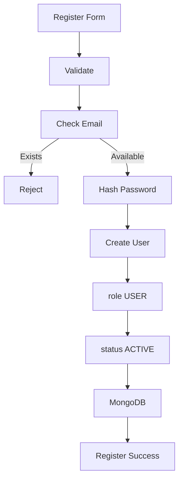

# DOCMIND AI – AUTHENTICATION FEATURE

> Tài liệu mô tả tổng quan và nghiệp vụ cho tính năng **Authentication & Authorization** của hệ thống **DOCMIND AI**.

---

# 1. Mục tiêu

Module Authentication chịu trách nhiệm:

- Đăng ký tài khoản.
- Đăng nhập.
- Đăng xuất.
- Xác thực người dùng.
- Phân quyền USER / ADMIN.
- Bảo vệ các API yêu cầu đăng nhập.
- Ngăn USER truy cập chức năng ADMIN.
- Ngăn tài khoản bị khóa tiếp tục sử dụng hệ thống.

Đây là module nền tảng, cần hoàn thành trước khi triển khai Document, AI Chat, RAG và Admin.

---

# 2. Vai trò hệ thống

DOCMIND AI có 2 role chính:

```text
USER
ADMIN
```

## USER

USER có thể:

- Đăng ký.
- Đăng nhập.
- Đăng xuất.
- Truy cập khu vực `/app`.
- Upload tài liệu.
- Hỏi AI.
- Xem lịch sử.
- Tóm tắt và so sánh tài liệu.

## ADMIN

ADMIN có thể:

- Đăng nhập.
- Truy cập khu vực `/admin`.
- Xem dashboard quản trị.
- Quản lý USER.
- Quản lý Document.

ADMIN không đăng ký từ form công khai.

---

# 3. Công nghệ sử dụng

## Frontend

- ReactJS
- TypeScript
- Ant Design
- Axios
- TanStack Query
- React Router DOM

## Backend

- Node.js
- Express.js
- TypeScript
- MongoDB
- Mongoose
- JWT
- bcrypt

---

# 4. User Model

```ts
User {
  _id: ObjectId;

  full_name: string;

  email: string;

  password: string;

  role: "USER" | "ADMIN";

  status: "ACTIVE" | "BLOCKED";

  created_at: Date;

  updated_at: Date;
}
```

---

# 5. Business Rules

## BR-AUTH-01

Email phải duy nhất.

Không cho phép 2 tài khoản sử dụng cùng một email.

---

## BR-AUTH-02

Email phải đúng định dạng.

Ví dụ hợp lệ:

```text
user@gmail.com
```

---

## BR-AUTH-03

Password không được lưu dạng plain text.

Password phải được hash bằng:

```text
bcrypt
```

trước khi lưu MongoDB.

---

## BR-AUTH-04

Khi đăng ký công khai:

```text
role = USER
```

Frontend không được phép gửi:

```json
{
  "role": "ADMIN"
}
```

để tự tạo tài khoản Admin.

Role phải được backend quyết định.

---

## BR-AUTH-05

Tài khoản mới mặc định:

```text
status = ACTIVE
```

---

## BR-AUTH-06

USER có:

```text
status = BLOCKED
```

không được phép đăng nhập.

---

## BR-AUTH-07

Route Admin chỉ cho phép:

```text
role = ADMIN
```

---

## BR-AUTH-08

API yêu cầu đăng nhập phải có JWT hợp lệ.

---

## BR-AUTH-09

Thông tin password không được trả về Frontend.

---

# 6. Đăng ký tài khoản

## Endpoint

```http
POST /api/auth/register
```

## Request

```json
{
  "full_name": "Nguyễn Văn An",
  "email": "annguyen@gmail.com",
  "password": "12345678",
  "confirm_password": "12345678"
}
```

## Backend xử lý

```text
Nhận request
    ↓
Validate dữ liệu
    ↓
Kiểm tra email tồn tại
    ↓
Kiểm tra password
    ↓
Hash password
    ↓
Tạo User
    ↓
role = USER
status = ACTIVE
    ↓
Lưu MongoDB
    ↓
Response
```

## Response thành công

```json
{
  "success": true,
  "message": "Đăng ký tài khoản thành công."
}
```

## Các trường hợp lỗi

### Email đã tồn tại

```json
{
  "success": false,
  "message": "Email đã được sử dụng."
}
```

### Password không khớp

```json
{
  "success": false,
  "message": "Mật khẩu xác nhận không khớp."
}
```

### Dữ liệu không hợp lệ

```json
{
  "success": false,
  "message": "Thông tin đăng ký không hợp lệ."
}
```

---

# 7. Đăng nhập

## Endpoint

```http
POST /api/auth/login
```

## Request

```json
{
  "email": "annguyen@gmail.com",
  "password": "12345678"
}
```

## Flow

```text
Email + Password
       ↓
Tìm User theo Email
       ↓
Không tồn tại?
       ↓
Reject

Có tồn tại
       ↓
bcrypt.compare()
       ↓
Password sai?
       ↓
Reject

Password đúng
       ↓
Kiểm tra status
       ↓
BLOCKED?
       ↓
Reject

ACTIVE
       ↓
Generate JWT
       ↓
Trả token + User info
```

## Response thành công

```json
{
  "success": true,
  "message": "Đăng nhập thành công.",
  "data": {
    "access_token": "JWT_TOKEN",
    "user": {
      "_id": "USER_ID",
      "full_name": "Nguyễn Văn An",
      "email": "annguyen@gmail.com",
      "role": "USER",
      "status": "ACTIVE"
    }
  }
}
```

---

# 8. JWT

JWT được sử dụng để xác định USER đang gửi request.

Payload đề xuất:

```ts
{
  userId: string;
  role: "USER" | "ADMIN";
}
```

Ví dụ:

```json
{
  "userId": "66f123abc",
  "role": "USER"
}
```

Backend ký token bằng:

```env
JWT_SECRET=
```

Không hard-code JWT Secret trong source code.

---

# 9. Access Token

Phiên bản MVP có thể sử dụng một Access Token để tiết kiệm thời gian triển khai.

Ví dụ thời gian sống:

```text
30 phút
```

hoặc:

```text
1 giờ
```

Nếu nhóm đã quen với Refresh Token thì có thể triển khai thêm.

---

# 10. Refresh Token – Optional

Refresh Token không bắt buộc trong MVP.

Nếu triển khai:

```text
Access Token: thời gian ngắn
Refresh Token: thời gian dài hơn
```

Endpoint:

```http
POST /api/auth/refresh-token
```

Refresh Token nên lưu bằng:

```text
httpOnly cookie
```

để tăng độ an toàn.

---

# 11. Lấy thông tin USER hiện tại

## Endpoint

```http
GET /api/auth/me
```

Header:

```http
Authorization: Bearer ACCESS_TOKEN
```

Response:

```json
{
  "success": true,
  "data": {
    "_id": "USER_ID",
    "full_name": "Nguyễn Văn An",
    "email": "annguyen@gmail.com",
    "role": "USER",
    "status": "ACTIVE"
  }
}
```

Endpoint này giúp Frontend:

- Restore session.
- Xác định role.
- Hiển thị thông tin USER.
- Điều hướng đúng dashboard.

---

# 12. Logout

Nếu MVP chỉ dùng Access Token:

Frontend thực hiện:

```text
Xóa token
↓
Xóa user state
↓
Redirect /login
```

Nếu sử dụng Refresh Token bằng cookie:

Backend nên có:

```http
POST /api/auth/logout
```

để xóa Refresh Token cookie.

---

# 13. Authentication Middleware

Middleware:

```text
authenticate
```

có nhiệm vụ:

1. Đọc Authorization Header.
2. Lấy Bearer Token.
3. Verify JWT.
4. Lấy USER từ database.
5. Kiểm tra USER tồn tại.
6. Kiểm tra USER ACTIVE.
7. Gán USER vào request.

Pseudo flow:

```text
Request
 ↓
Authorization Header
 ↓
JWT Verify
 ↓
Find User
 ↓
Check status
 ↓
req.user
 ↓
Next()
```

---

# 14. Authorization Middleware

Middleware:

```text
authorizeRole()
```

Ví dụ:

```ts
authorizeRole("ADMIN")
```

Route:

```http
GET /api/admin/users
```

chỉ ADMIN truy cập.

Nếu USER truy cập:

```http
403 Forbidden
```

Response:

```json
{
  "success": false,
  "message": "Bạn không có quyền truy cập chức năng này."
}
```

---

# 15. Protected Routes

Ví dụ USER API:

```text
/api/documents/*
/api/chat/*
/api/conversations/*
/api/notifications/*
```

phải chạy qua:

```text
authenticate
```

Admin API:

```text
/api/admin/*
```

phải chạy qua:

```text
authenticate
+
authorizeRole("ADMIN")
```

---

# 16. Frontend Authentication State

Frontend cần lưu:

```ts
{
  user,
  accessToken,
  isAuthenticated
}
```

Có thể quản lý bằng:

- React Context.
- Zustand.
- Redux Toolkit.

Với MVP, Context hoặc Zustand là đủ.

---

# 17. Axios Interceptor

Axios nên tự động thêm:

```http
Authorization: Bearer TOKEN
```

vào request.

Ví dụ:

```ts
axiosInstance.interceptors.request.use(...)
```

Nếu API trả:

```http
401 Unauthorized
```

Frontend:

```text
Clear Auth
↓
Redirect /login
```

---

# 18. Frontend Route Guard

Cần ít nhất 2 loại route guard.

## Private Route

Chỉ USER đã login mới vào.

Ví dụ:

```text
/app/*
```

Nếu chưa login:

```text
redirect /login
```

---

## Admin Route

Điều kiện:

```text
isAuthenticated = true
role = ADMIN
```

Nếu role USER:

```text
redirect /app
```

---

# 19. Luồng sau khi Login

Sau khi login thành công:

## USER

```text
role = USER
    ↓
/app/dashboard
```

## ADMIN

```text
role = ADMIN
    ↓
/admin
```

---

# 20. Login Page

Form gồm:

- Email.
- Password.
- Remember me – optional.
- Button Đăng nhập.
- Link Đăng ký.

Không cần triển khai trong MVP:

- Google Login.
- Facebook Login.
- OTP Login.

---

# 21. Register Page

Form:

- Họ và tên.
- Email.
- Password.
- Confirm Password.

Validation Frontend:

- Required.
- Email format.
- Password length.
- Confirm password.

Validation Backend vẫn bắt buộc.

Không được chỉ tin validation Frontend.

---

# 22. Account Status

Có 2 trạng thái:

```text
ACTIVE
BLOCKED
```

## ACTIVE

Sử dụng hệ thống bình thường.

## BLOCKED

Không được:

- Login.
- Upload.
- Chat AI.
- Gọi USER API.

---

# 23. Admin Block USER

Endpoint:

```http
PATCH /api/admin/users/:id/block
```

Backend:

```text
Validate ADMIN
      ↓
Find User
      ↓
status = BLOCKED
      ↓
Save
```

---

# 24. Admin Unblock USER

Endpoint:

```http
PATCH /api/admin/users/:id/unblock
```

Backend:

```text
status = ACTIVE
```

---

# 25. Security Requirements

## Password

- Hash bằng bcrypt.
- Không log password.
- Không response password.

## JWT

- Secret lưu trong `.env`.
- Verify token ở Backend.
- Không tin role từ Frontend.

## API

- Validate input.
- Protected routes.
- Role middleware.
- Không expose sensitive fields.

## Environment

Không commit:

```text
.env
```

---

# 26. Environment Variables

Ví dụ:

```env
JWT_SECRET=your_secret_key
JWT_EXPIRES_IN=1h
```

Nếu dùng refresh token:

```env
JWT_REFRESH_SECRET=
JWT_REFRESH_EXPIRES_IN=7d
```

---

# 27. Backend Structure đề xuất

```text
src/
├── controllers/
│   └── auth.controller.ts
│
├── services/
│   └── auth.service.ts
│
├── models/
│   └── user.model.ts
│
├── routes/
│   └── auth.route.ts
│
├── middlewares/
│   ├── authenticate.middleware.ts
│   └── authorize.middleware.ts
│
├── utils/
│   └── jwt.ts
│
└── types/
    └── auth.ts
```

---

# 28. Trách nhiệm từng layer

## auth.controller.ts

- Nhận Request.
- Gọi Service.
- Trả Response.

Không xử lý quá nhiều business logic.

---

## auth.service.ts

Xử lý:

- Register.
- Login.
- Hash password.
- Check password.
- Generate JWT.

---

## user.model.ts

Mongoose Schema của User.

---

## authenticate.middleware.ts

Verify JWT.

---

## authorize.middleware.ts

Kiểm tra role.

---

# 29. API Summary

| Method | Endpoint | Auth | Role | Mục đích |
|---|---|---|---|---|
| POST | `/api/auth/register` | No | Public | Đăng ký |
| POST | `/api/auth/login` | No | Public | Đăng nhập |
| GET | `/api/auth/me` | Yes | USER/ADMIN | USER hiện tại |
| POST | `/api/auth/logout` | Optional | USER/ADMIN | Đăng xuất |
| POST | `/api/auth/refresh-token` | Optional | USER/ADMIN | Refresh token |
| PATCH | `/api/admin/users/:id/block` | Yes | ADMIN | Khóa USER |
| PATCH | `/api/admin/users/:id/unblock` | Yes | ADMIN | Mở khóa USER |

---

# 30. Error Codes đề xuất

## 400 Bad Request

Dữ liệu request không hợp lệ.

## 401 Unauthorized

- Chưa đăng nhập.
- Token sai.
- Token hết hạn.
- Password sai.

## 403 Forbidden

Không đủ quyền.

Ví dụ USER vào Admin API.

## 404 Not Found

USER không tồn tại.

## 409 Conflict

Email đã tồn tại.

## 500 Internal Server Error

Lỗi hệ thống.

---

# 31. Response Format

Nên thống nhất toàn Backend.

## Success

```json
{
  "success": true,
  "message": "Đăng nhập thành công.",
  "data": {}
}
```

## Error

```json
{
  "success": false,
  "message": "Email hoặc mật khẩu không chính xác."
}
```

---

# 32. Authentication Flow tổng thể

```mermaid
flowchart TD

    A[USER nhập Email + Password] --> B[POST /api/auth/login]

    B --> C[Tìm User]

    C -->|Không tồn tại| E[Login Failed]

    C -->|Tồn tại| D[bcrypt.compare]

    D -->|Sai| E

    D -->|Đúng| F[Kiểm tra Status]

    F -->|BLOCKED| G[Reject]

    F -->|ACTIVE| H[Generate JWT]

    H --> I[Response Token + User]

    I --> J{Role}

    J -->|USER| K[/app/dashboard]

    J -->|ADMIN| L[/admin]
```

---

# 33. Register Flow



---

# 34. Acceptance Criteria

Authentication được xem là hoàn thành khi:

- USER đăng ký được.
- Email trùng bị từ chối.
- Password được hash.
- USER login đúng thông tin được.
- Login sai bị từ chối.
- BLOCKED USER không login được.
- JWT được tạo.
- `/api/auth/me` hoạt động.
- Protected API yêu cầu token.
- USER không truy cập `/api/admin/*`.
- ADMIN truy cập được Admin API.
- Frontend redirect theo role.
- Logout xóa trạng thái đăng nhập.

---

# 35. Phạm vi MVP

## Bắt buộc

- Register.
- Login.
- Logout.
- JWT.
- USER / ADMIN.
- ACTIVE / BLOCKED.
- Auth middleware.
- Role middleware.
- Route Guard.
- Axios auth header.

## Có thể làm sau

- Forgot Password.
- OTP.
- Email Verification.
- Refresh Token nếu chưa quen.
- Google Login.
- Two-Factor Authentication.
- Login history.
- Device management.

---

# 36. Hướng phát triển Authentication

Sau MVP có thể bổ sung:

- Refresh Token đầy đủ.
- Forgot Password bằng OTP.
- Email Verification.
- Google OAuth.
- Microsoft OAuth.
- Two-Factor Authentication.
- Login Activity.
- Device Session Management.
- Change Password.
- Force Logout.
- Rate Limit Login.
- Captcha.
- Account Recovery.

---

# 37. Kết luận

Authentication của DOCMIND AI có nhiệm vụ chính là:

```text
Register
   ↓
Login
   ↓
JWT
   ↓
Authentication
   ↓
Authorization
   ↓
USER / ADMIN
```

Trong thời gian MVP, ưu tiên triển khai luồng đơn giản, an toàn và ổn định.

Không nên dành quá nhiều thời gian cho OAuth, OTP hoặc các chức năng Auth nâng cao khi phần RAG của hệ thống chưa hoàn thiện.

> Mục tiêu của module Auth là bảo đảm đúng người dùng, đúng quyền và bảo vệ các tài nguyên của DOCMIND AI.
